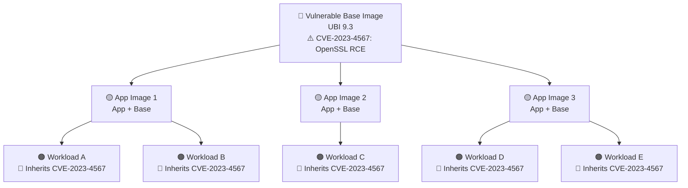
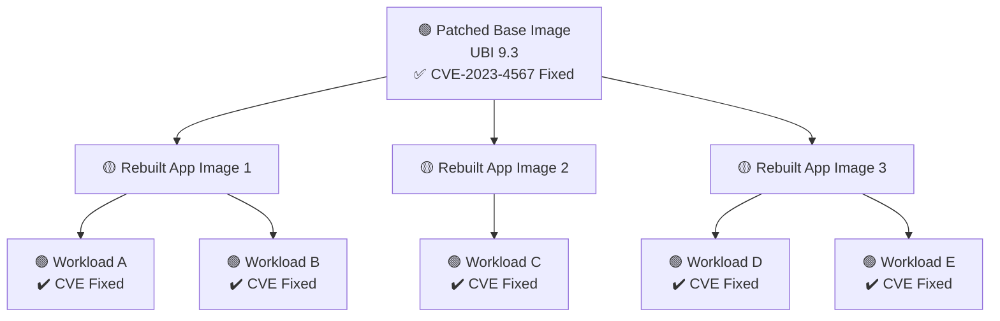

# From CVE Overload to Security Maturity

### *How Small Shifts Create Big Wins in Container Security*

---

## Why This Conversation Matters

You’ve invested in Kubernetes.  
You have visibility. You’re scanning.  
But the vulnerabilities keep coming… and the backlog keeps growing.

❗ Fixes are reactive  
❗ CVE dashboards feel overwhelming  
❗ Risk is unclear, and trust is uncertain

The challenge isn’t the tool. It’s the approach.  
And small, strategic changes can shift your posture from reactive to resilient.

---

## The CVE Problem Is Not Getting Better, It’s Accelerating

The number of vulnerabilities keeps rising and the backlog makes it harder to triage, prioritize, and act.

### Why It Used to Feel Simpler

In traditional environments, vulnerability management often felt more controlled, and quieter.
- VMs were typically patched using tools like WSUS or Red Hat Satellite, which focused on available updates, not full vulnerability exposure.
- Security teams would often ensure patches were applied before scheduled vulnerability scans with tools like Nessus, which might run weekly or monthly.
- As a result, vulnerability reports were shorter, cleaner, and focused mostly on what was patchable at the time, not what was truly present or newly disclosed.

It wasn’t that there were fewer vulnerabilities, we just had less visibility into them.

That’s why the shift to container security, with continuous scanning, dependency awareness, and full-stack visibility, can feel overwhelming at first.

---

In a world where CVEs are piling up faster than they can be processed, the idea of a “zero CVE” image sounds comforting, right?

## The Fallacy of “Zero CVE” Images

> “This image has zero CVEs” sounds great, until next week.

### The Reality: 
- “Zero-CVE” is meaningless without lifecycle discipline, a clean image today can accumulate critical CVEs in a matter of days. But blindly chasing Zero-CVE can also introduce risk: rebuilding with the latest packages might bring in breaking changes or regressions, especially when scanners fail to recognize backported fixes. Without clear provenance and compatibility guarantees, ‘fixing’ a CVE might unintentionally break the application.”

### Why This Matters:

Even trusted vendors offering “zero CVE” images rely on:
- A customer willing to rebuild and redeploy frequently  
- A proactive image lifecycle management strategy  

> **Security is not a static claim. It’s a moving target, and it requires process.**

---

## Why It Feels Like There Are More Vulnerabilities Now

Vulnerabilitie scanners often surface more vulnerabilities than what teams were used to seeing in traditional environments, and that can feel overwhelming at first.

But the reality is:
- These tools aren’t generating noise, they’re providing full visibility.
- In traditional monolithic, VM-based systems, the scope of analysis was smaller: fewer services, fewer components, and often only patch-based scanning.
- As we modernize and break monoliths into microservices, we naturally introduce more code, more packages, and more dependencies, all of which can be independently analyzed.
- Modern container security solutions give you insight into everything, base images, packages, libraries, exposure, privileges, across hundreds of services.

So it’s not that you suddenly have “more vulnerabilities.”
It’s that for the first time, you can see them all, and act on them effectively.

## Visibility is only powerful if it leads to action.

Without process changes, known risks persist, and replicate across every workload built from the same source.

### So what happens when you skip that process?

You unintentionally amplify risk across your entire environment.  
A single vulnerable base image becomes the foundation for dozens, sometimes hundreds, of workloads.

Let’s visualize that…

---

## 🔍 Visual: CVE Inheritance from Base Image

---

## So where do you start fixing this at scale?

You don’t start at the workload.  
You start at the source, the base image.

Choosing a trusted, maintained base image and taking ownership of it is one of the most impactful security decisions you can make.

---

## Start Where It Matters: Base Image Hygiene

Most vulnerabilities don’t come from your developers, they come from your base image.

### Best Practices:
- ✅ Use curated, trusted base images (e.g. UBI, RHEL)  
- ✅ Mirror and scan in a trusted registry (Quay)  
- ✅ Enforce digest pinning (`sha256`), not floating tags  
- ✅ Automate rebuilds when base image updates  
- ✅ Track image provenance and ownership  

> “If your base is clean, your stack is clean.”

---

## Visual: Fix the Base Once, Patch Everything

---

## Adopt Immutable, Trusted Workflows

> If vulnerabilities are inevitable, what matters is how quickly and safely you can respond.  
> That’s why immutability isn’t just a dev best practice, it’s a security strategy.

Containers should never be patched in place.  
Instead: **rebuild → redeploy → replace**.

### Why It Matters:
- ✅ Clean history and audit trail  
- ✅ Enables GitOps and automation  
- ✅ Safer rollbacks and updates  
- ✅ Eliminates “configuration drift” over time  

> This supports the **“build once, deploy everywhere”** model.

---

## CI/CD Integration: Shift Left, Build Trust

> But immutability alone isn’t enough, we need to stop issues earlier, before they ever reach production.  
> That means embedding security into the **build pipeline**, where change begins.

Security must be embedded into your pipelines:

### What to Integrate:
- Inline vulnerability scans in CI pipelines  
- Fail builds with:  
  - Unapproved base images  
  - Critical CVEs with fixes available  
- Sign images during build (e.g. Cosign)  
- Push only to trusted registries  
- Enforce digests at deploy  

> “Speed doesn’t matter if you can’t trust the output.”

---

## Deploy Defensively: Context-Aware Runtime Controls

> Of course, no build is perfect, and production is where intent meets reality.  
> That’s why we need real-time safeguards in the cluster: context-aware, policy-enforced, and always watching.

Once deployed, modern security platforms help you enforce context-based policy decisions:

- Block workloads with:  
  - Excessive capabilities  
  - Privilege escalation (root, hostPath)  
  - Internet exposure (e.g., no ingress controls)  
- Use network graph + enforcement to isolate apps  

---

## GitOps: Control + Consistency + Confidence

> Once teams are aligned, the next step is automation.  
> **GitOps** brings consistency and control to everything, workloads, policies, even the platform itself.

With GitOps:
- Declarative app definitions (Helm, Kustomize, ArgoCD)  
- Declarative security policies  
- Automated reconciliations  
- Full Git audit trail and rollback  

> This creates a **self-healing, continuously enforced environment.**

---

## Summary: Secure by Design

> When you put all of this together, a pattern emerges.  
> This isn’t just a toolkit, it’s a system for **resilient, scalable security.**

| **Area**        | **Best Practice**                                 |
|-----------------|---------------------------------------------------|
| Base image      | Use trusted, pinned, scanned base images          |
| Build           | Scan, sign, and enforce policy at build time      |
| Deploy          | Enforce digest + admission controls               |
| Runtime         | Block excessive privileges, isolate workloads     |
| Visibility      | Use security platforms to track, triage, and own risk |
| Process         | Immutable workflows + GitOps promotion            |

---

## Final Message

> CVE dashboards will always be full.  
> But what matters is whether you’re *drowning in noise*, or *driving risk down with confidence*.  
> This is how we shift from reactive to proactive, from overwhelmed to in control.

---

### RedHat gives you the tools.  
### Best practices give you control.  
### This is your path to sustainable, scalable security.
