# From CVE Overload to Security Maturity

### *How Small Shifts Create Big Wins in Container Security*

---

## Why This Conversation Matters

You’ve invested in OpenShift and RHACS.  
You have visibility. You’re scanning.  
But the vulnerabilities keep coming… and the backlog keeps growing.

❗ Fixes are reactive  
❗ CVE dashboards feel overwhelming  
❗ Risk is unclear — and trust is uncertain

The challenge isn’t the tool. It’s the approach.  
And small, strategic changes can shift your posture from reactive to resilient.

---

## The CVE Problem Is Not Getting Better — It’s Accelerating

The number of vulnerabilities keeps rising — and the backlog makes it harder to triage, prioritize, and act.

### Why It Used to Feel Simpler

In traditional environments, vulnerability management often felt more controlled — and quieter.
- VMs were typically patched using tools like WSUS or Red Hat Satellite, which focused on available updates, not full vulnerability exposure.
- Security teams would often ensure patches were applied before scheduled vulnerability scans with tools like Nessus, which might run weekly or monthly.
- As a result, vulnerability reports were shorter, cleaner, and focused mostly on what was patchable at the time — not what was truly present or newly disclosed.

It wasn’t that there were fewer vulnerabilities — we just had less visibility into them.

That’s why the shift to container security — with continuous scanning, dependency awareness, and full-stack visibility — can feel overwhelming at first.

---

In a world where CVEs are piling up faster than they can be processed, the idea of a “zero CVE” image sounds comforting, right?

## The Fallacy of “Zero CVE” Images

> “This image has zero CVEs” sounds great — until next week.

### The Reality: 
- “Zero-CVE” is meaningless without lifecycle discipline — without rebuilding and updating, a clean image today can accumulate critical CVEs in a matter of days”

### Why This Matters:

Even trusted vendors offering “zero CVE” images rely on:
- A customer willing to rebuild and redeploy frequently  
- A proactive image lifecycle management strategy  

> **Security is not a static claim. It’s a moving target — and it requires process.**

---

## Why It Feels Like There Are More Vulnerabilities Now

Tools like RHACS often surface more vulnerabilities than what teams were used to seeing in traditional environments — and that can feel overwhelming at first.

But the reality is:
- RHACS is not generating noise — it’s providing full visibility.
- In traditional monolithic VM-based systems, the scope of analysis was smaller — fewer services, fewer components, and often patch-based scanning only.
- As we modernize and break monoliths into microservices, we naturally introduce more code, more packages, and more dependencies — all of which can be independently analyzed.
- RHACS gives you insight into all of it — base images, packages, libraries, exposure, privileges — across hundreds of services.

So it’s not that you suddenly have “more vulnerabilities.”
It’s that for the first time, you can see them all — and act on them effectively.

## Visibility is only powerful if it leads to action.

Without process changes, known risks persist — and replicate across every workload built from the same source.

### So what happens when you skip that process?

You unintentionally amplify risk across your entire environment.  
A single vulnerable base image becomes the foundation for dozens — sometimes hundreds — of workloads.

Let’s visualize that…

---

## 🔍 Visual: CVE Inheritance from Base Image

```mermaid
graph TD
    A[🔵 Vulnerable Base Image<br>UBI 9.3<br>⚠️ CVE-2023-4567: OpenSSL RCE] --> B1[🟡 App Image 1<br>App + Base]
    A --> B2[🟡 App Image 2<br>App + Base]
    A --> B3[🟡 App Image 3<br>App + Base]

    B1 --> C1[🟠 Workload A<br>🚨 Inherits CVE-2023-4567]
    B1 --> C2[🟠 Workload B<br>🚨 Inherits CVE-2023-4567]
    B2 --> C3[🟠 Workload C<br>🚨 Inherits CVE-2023-4567]
    B3 --> C4[🟠 Workload D<br>🚨 Inherits CVE-2023-4567]
    B3 --> C5[🟠 Workload E<br>🚨 Inherits CVE-2023-4567]
```

---

## So where do you start fixing this at scale?

You don’t start at the workload.  
You start at the source — the base image.

Choosing a trusted, maintained base image and taking ownership of it is one of the most impactful security decisions you can make.

---

## Start Where It Matters: Base Image Hygiene

Most vulnerabilities don’t come from your developers — they come from your base image.

### Best Practices:
- ✅ Use curated, trusted base images (e.g. UBI, RHEL)  
- ✅ Mirror and scan in a trusted registry (Quay)  
- ✅ Enforce digest pinning (`sha256`) — not floating tags  
- ✅ Automate rebuilds when base image updates  
- ✅ Track image provenance and ownership  

> “If your base is clean, your stack is clean.”

---

## Visual: Fix the Base Once, Patch Everything

```mermaid
graph TD
    A[🟢 Patched Base Image<br>UBI 9.3<br>✅ CVE-2023-4567 Fixed] --> B1[🟡 Rebuilt App Image 1]
    A --> B2[🟡 Rebuilt App Image 2]
    A --> B3[🟡 Rebuilt App Image 3]

    B1 --> C1[🟢 Workload A<br>✔️ CVE Fixed]
    B1 --> C2[🟢 Workload B<br>✔️ CVE Fixed]
    B2 --> C3[🟢 Workload C<br>✔️ CVE Fixed]
    B3 --> C4[🟢 Workload D<br>✔️ CVE Fixed]
    B3 --> C5[🟢 Workload E<br>✔️ CVE Fixed]
```

---

## Adopt Immutable, Trusted Workflows

> If vulnerabilities are inevitable, what matters is how quickly and safely you can respond.  
> That’s why immutability isn’t just a dev best practice — it’s a security strategy.

Containers should never be patched in place.  
Instead: **rebuild → redeploy → replace**.

### Why It Matters:
- ✅ Clean history and audit trail  
- ✅ Enables GitOps and automation  
- ✅ Safer rollbacks and updates  
- ✅ Eliminates “configuration drift” over time  

> This supports the **“build once, deploy everywhere”** model.

---

## CI/CD Integration: Shift Left, Build Trust

> But immutability alone isn’t enough — we need to stop issues earlier, before they ever reach production.  
> That means embedding security into the **build pipeline**, where change begins.

Security must be embedded into your pipelines:

### What to Integrate:
- RHACS inline scans in CI pipelines  
- Fail builds with:  
  - Unapproved base images  
  - Critical CVEs with fixes available  
- Sign images during build (e.g. Cosign)  
- Push only to trusted registries  
- Enforce digests at deploy  

> “Speed doesn’t matter if you can’t trust the output.”

---

## Deploy Defensively: Context-Aware Runtime Controls

> Of course, no build is perfect — and production is where intent meets reality.  
> That’s why we need real-time safeguards in the cluster: context-aware, policy-enforced, and always watching.

Once deployed, RHACS helps you enforce context-based policy decisions:

- Block workloads with:  
  - Excessive capabilities  
  - Privilege escalation (root, hostPath)  
  - Internet exposure (e.g., no ingress controls)  
- Use network graph + enforcement to isolate apps  

---

## Design for Ownership at Scale

> This can’t be owned by one team.  
> To scale securely, **every team must own their layer** — with shared guardrails and clear boundaries.

### Split responsibilities by layer:

| **Layer**       | **Owner**         | **Focus**                           |
|-----------------|------------------|-------------------------------------|
| Base image      | Platform team     | Trust, scanning, patching           |
| Middleware      | Architects        | Compatibility, policy               |
| Application     | Developers        | Business logic, agility             |

Each team owns security for their layer, but shares a common platform and enforcement model.

---

## GitOps: Control + Consistency + Confidence

> Once teams are aligned, the next step is automation.  
> **GitOps** brings consistency and control to everything — workloads, policies, even the platform itself.

With GitOps:
- Declarative app definitions (Helm, Kustomize, ArgoCD)  
- Declarative security policies (RHACS)  
- Automated reconciliations  
- Full Git audit trail and rollback  

> This creates a **self-healing, continuously enforced environment.**

---

## Summary: Secure by Design

> When you put all of this together, a pattern emerges.  
> This isn’t just a toolkit — it’s a system for **resilient, scalable security.**

| **Area**        | **Best Practice**                                 |
|-----------------|---------------------------------------------------|
| Base image      | Use trusted, pinned, scanned base images          |
| Build           | Scan, sign, and enforce policy at build time      |
| Deploy          | Enforce digest + admission controls               |
| Runtime         | Block excessive privileges, isolate workloads     |
| Visibility      | Use RHACS to track, triage, and own risk          |
| Process         | Immutable workflows + GitOps promotion            |

---

## Final Message

> CVE dashboards will always be full.  
> But what matters is whether you’re *drowning in noise* — or *driving risk down with confidence*.  
> This is how we shift from reactive to proactive, from overwhelmed to in control.

---

### RedHat gives you the tools.  
### Best practices give you control.  
### This is your path to sustainable, scalable security.
